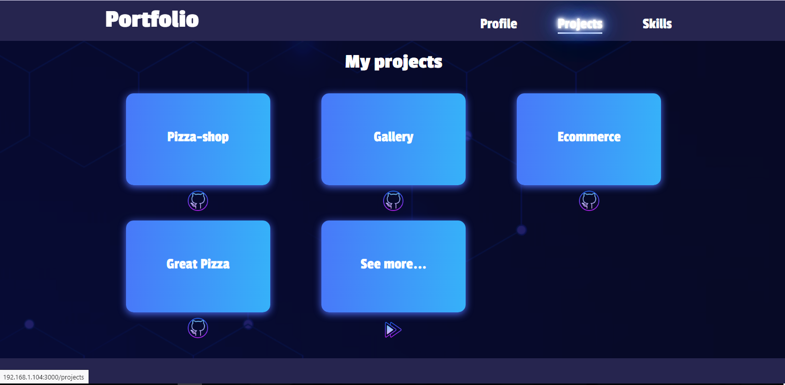

## Portfolio - React.js - Template

TEST: https://portfolio-react-js-template.vercel.app

## Screenshots

## 
## 

## Commands

### `yarn install`
yarn install is used to install all dependencies for a project.

### `yarn start`
Runs the app in the development mode.
Open [http://localhost:3000](http://localhost:3000) to view it in the browser.

### `yarn test`
Launches the test runner in the interactive watch mode.
See the section about [running tests](https://facebook.github.io/create-react-app/docs/running-tests) 
for more information.

### `yarn build`
Builds the app for production to the `build` folder.\
It correctly bundles React in production mode and optimizes the build for the best performance.

## Technologies

| React.js |  A JavaScript library for building user interfaces   |
| :------: | :--------------------------------------------------: |
|   CSS    | Language for describing the appearance of a document |

